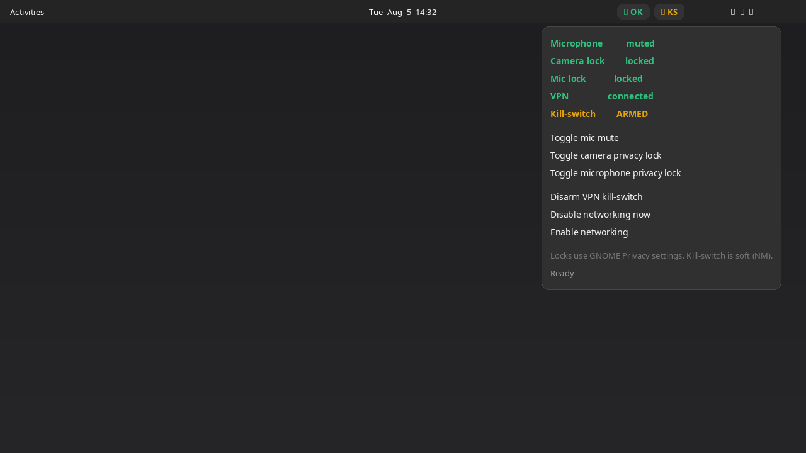

# Privacy Kill Dashboard

GNOME Shell extension for mic mute, camera/mic privacy locks, and a soft VPN kill-switch.



## Features

- Panel summary: `OK`, or flags like `MIC`, `CAM`, `KS`, `NET×`
- Toggle default input (mic) mute
- Toggle camera and microphone privacy locks (`org.gnome.desktop.privacy`)
- Arm a soft kill-switch: if VPN/WireGuard/Tailscale was up and then drops, NetworkManager networking is disabled
- Manual disable/enable networking via NetworkManager

## Requirements

- GNOME Shell **45–50**
- NetworkManager (for VPN detection and kill-switch)

## Install

```bash
UUID=privacy-kill-dashboard@n0l0g1c.github.io
mkdir -p ~/.local/share/gnome-shell/extensions
cp -a "$UUID" ~/.local/share/gnome-shell/extensions/
gnome-extensions enable "$UUID"
```

Log out/in on Wayland (or restart GNOME Shell) so the extension is picked up.

## Configuration

Optional: `~/.config/privacy-kill-dashboard/settings.json`

```json
{
  "killSwitchArmed": false
}
```

## Limits

- Privacy locks are the same as **Settings → Privacy**.
- Kill-switch is **soft** (NM networking off), not a kernel/nftables kill-switch. Prefer your VPN client’s hard kill-switch when you need that.

## Packaging

```bash
./pack.sh
# → privacy-kill-dashboard@n0l0g1c.github.io.shell-extension.zip
```

## License

[GPL-2.0-or-later](LICENSE)

## Author

[N0L0g1c](https://github.com/N0L0g1c)
